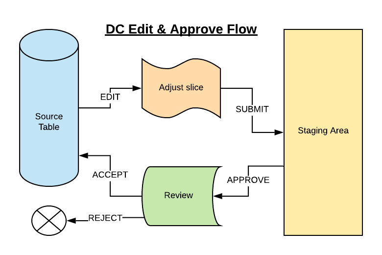

# Data Controller for SAS®: Overview

## What does the Data Controller do?

The Data Controller allows users to add, modify, and delete data. All changes are staged and approved before being applied to the target table. The review process, as well as using generic and repeatable code to perform updates, works to ensure data integrity.

## What is a Target Table?
A Target Table is a physical table, such as a SAS dataset or a Table in a database. The attributes of this table (eg Primary Key, loadtype, library, SCD variables etc) will have been predefined by your administrator so that you can change the data in that table safely and easily.

## How does it work?

From the Editor tab, a user selects a library and table for editing. Data can then be edited directly, or a uploaded from a file.  After submitting the change, the data is loaded to a secure staging area, and the approvers are notified.  The approver (which may also be the editor, depending on configuration) reviews the changes and accepts / or rejects them. If accepted, the changes are applied to the target table by the system account, and the history of that change is recorded.

## Who is it for?

There are 5 roles identified for users of the Data Controller:

1. *Viewer*.  A viewer uses the Data Controller as a means to explore data without risk of locking datasets. By using the Data Controller to view data, it also becomes possible to 'link' to data (eg copy the url to share a table with a colleague).
2. *Editor*.  An editor makes changes to data in a table (add, modify, delete) and submits those changes to the approver(s) for acceptance.
3. *Approver*.  An approver accepts / rejects proposed changes to data under their control. If accepted, the change is applied to the target table.
4. *Auditor*.  An auditor has the ability to review the [history](dc-userguide.md#history) of changes to a particular table.
5. *Administrator*.  An administrator has the ability to add new [tables](dcc-tables.md) to the Data Controller, and to configure the security settings (at metadata group level) as required.

## What is a submission?

The submission is the data that has been staged for approval.  Note - submissions are never applied automatically!  They must always be approved by 1 or more approvers first.  The process of submission varies according to the type of submit.

### Web Submission
When using the Web editor, a frontend check is made against the subset of data that was filtered for editing to see which rows are new / modified / marked deleted.  Only those changed rows (from the extract) are submitted to the staging area. 

### Excel Submission
When importing an excel file, all rows are loaded into the web page.  You have an option to edit those records.  If you edit them, the original excel is discarded, and only changed rows are submitted (it becomes a web submission).  If you hit SUBMIT immediately, then ALL rows are staged, and a copy of the excel file is uploaded for audit purposes.

### CSV submission
A CSV upload bypasses the part where the records are loaded into the web page, and ALL rows are sent to the staging area directly.  This makes it suitable for larger uploads.

## Edit Stage Approve Workflow
Up to 500 rows can be edited (in the web editor) at one time.  These edits are submitted to a staging area.  After one or more approvals (acceptances) the changes are applied to the source table.

## Use Case Diagram

There are five roles (Viewer, Editor, Approver, Auditor, Administrator) which correspond to 5 primary use cases (View Table, Edit Table, Approve Change, View Change History, Configure Table)

