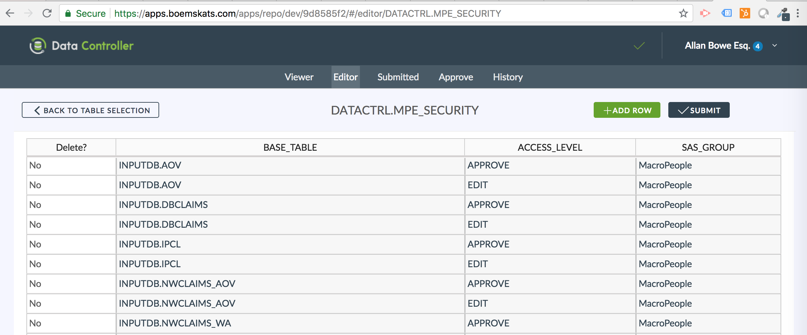

# Data Controller for SAS® - Security

## Summary
DC security is applied at the level of Table and Group.  Permissions can only be set at group level. There are two parts to adding a user:

1 - Adding the user to the relevant group in SAS metadata

2 - Ensuring that group has the appropriate access level in the configuration table

For guidance with adding SAS users, see [SAS Documentation](http://support.sas.com/documentation/cdl/en/mcsecug/69854/HTML/default/viewer.htm#n05epzfefjyh3dn1xdw2lkaxwyrz.htm).

## Details

In order to surface a table to a new group, simply add a record to the `DATACTRL.MPE_SECURITY` table.  The `library.dataset` value should go in the `BASE_TABLE` field, the level of access (either _EDIT_ or _APPROVE_) should go in the `ACCESS_LEVEL` field, and the exact name of the relevant metadata group should go in the `SAS_GROUP` field.  The change should then be submitted, and approved, at which point the new security setting will be applied.



##  ACCESS_LEVEL

### EDIT

The `EDIT` permission determines which groups will be able to upload CSVs and submit changes via the web interface for that table.

### APPROVE
The `APPROVE` permission determines which groups will be able to approve those changes, and hence enable the target table to be loaded.  If you wish to have members of a particular group both edit AND approve, then two lines (one for each group) must be entered, per table.

### VIEW
The default behaviour when installing Data Controller is that the [viewer](dcu-tableviewer.md) lets all SAS Users see all the tables that they are authorised to view in SAS.  However there may be reasons to further restrict the tables in this component.

There is a global setting that will disable ALL tables in VIEWER unless explicitly authorised - this is available in MPE_CONFIG.  Set `DC_RESTRICT_VIEWER=YES`, submit, and approve.

If authorising groups without this setting, it means that tables will be restricted only in that library (the rest will still be visible).

Groups can be given VIEW access for all libraries or all tables within a library by using the keyword `*ALL*` instead of the libref / tablename.

It's also worth being aware of the `DC_VIEWLIB_CHECK` option in MPE_CONFIG.  When this is switched on, SAS will confirm that the library is valid and contains tables, before adding to the list.  This can sometimes be slow (depending on your library configurations), hence disabled - but as the list is actually cached on frontend (until the next hard refresh) the impact may worth it.

## Determining Group Members

Before adding a group to Data Controller, it helps to know the members of that group!  The following options are available:

1 - Use SAS Management Console

2- Use Code

The "code" option can be performed as follows:

```
/* get macro library */
filename mc url "https://raw.githubusercontent.com/macropeople/macrocore/master/mc_all.sas";
%inc mc;
/* call macro */
%mm_getgroupmembers(YOURGROUPNAME)
/* the above will create a dataset containing the group members */
```

Another option is to use the custom groups feature by defining your own groups in the [MPE_GROUPS](dcc-groups.md) table.