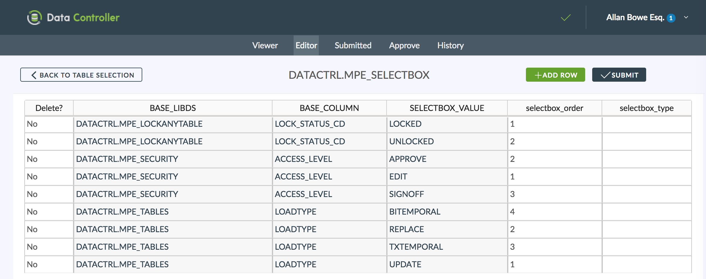

# Data Controller for SAS® - Selectboxes

## Overview
To ensure data validity and to improve user experience, it is possible to predesignate specific values for data entry.  These appear to the user as a selectbox within the editor interface.

## Configuration
Values are added by populating the `DATACTRL.MPE_SELECTBOX` table, eg below:

### BASE_LIBDS
The library.dataset to which the selectbox needs to be applied

### BASE_COLUMN
The column in which the selectbox values will be entered

### SELECTBOX_VALUE
The actual values to be shown in the selectbox

### SELECTBOX_ORDER
The order in which the selectbox values should be displayed

### SELECTBOX_TYPE
Reserved for future use.
