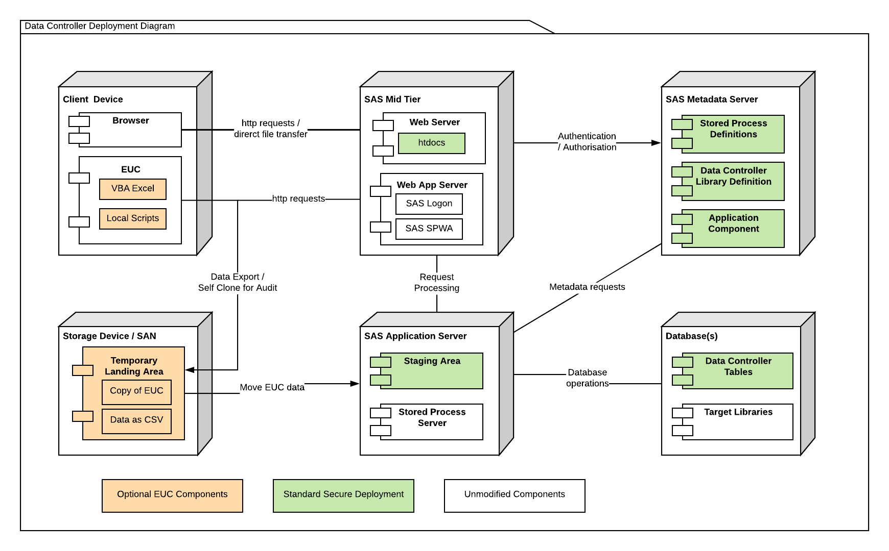

#Data Controller for SAS® - Backend Deployment

## Overview
The backend for Data Controller consists of a set of Stored Processes, a macro library, and a database.  The database can be SAS Base library if desired, however this can cause contention (eg table locks) if end users are able to connect to the datasets directly, eg via Enterprise Guide or Base SAS.

## Regular Deployment

1 - Import `/sas/import.spk` using SAS Management Console.  Make a note of the root location in which this was deployed - as this will be added to the `metadataRoot` value in the `h54sConfig.json` file in the [frontend](dci-frontend.md#details) deployment.

2 - Create a physical staging directory.  This folder will contain the logs and CSV files generated by Users.  The SAS Spawned Server account (eg `sassrv`) will need write access to this location.

3 - Register a library in metadata for the control database.  The libref should be `DATACTRL`.  If this is not possible, then an alternative libref can be used, simply specify it in the configuration component.

4 - Update the configuration component (imported in the SPK) with the following attributes:

* `dc_staging_area` - location of staging directory as per step 2
* `dc_admin_group` - enter the name of a metadata group (eg SASAdministrators) that should be given unrestricted access to the tool
* `dc_libref` - if you were unable to use the `DATACTRL` libref in step 3, then use the updated libref here

5 - Deploy the physical tables and register them in metadata.  For this, simply compile and run the `mpe_build()` macro using an  account with appropriate priviliges.

!!! note
    Make sure the SAS Spawned Server account (eg `sassrv`) can access these tables!

The next step is to deploy the [frontend](dci-frontend.md).

## EUC Deployment

Optionally, a shared network drive can be configured to enable EUCs to temporarily stage CSVs for upload into the Data Controller review process.
For security, it is recommended to set permissions so that end users can write, but not read or modify.  The SAS Spawned Server account (eg `sassrv`) will need read and modify access - as it will remove the files once they are loaded into the secure staging area.

## Deployment Diagram

An overview of how the components fit together is available below:

