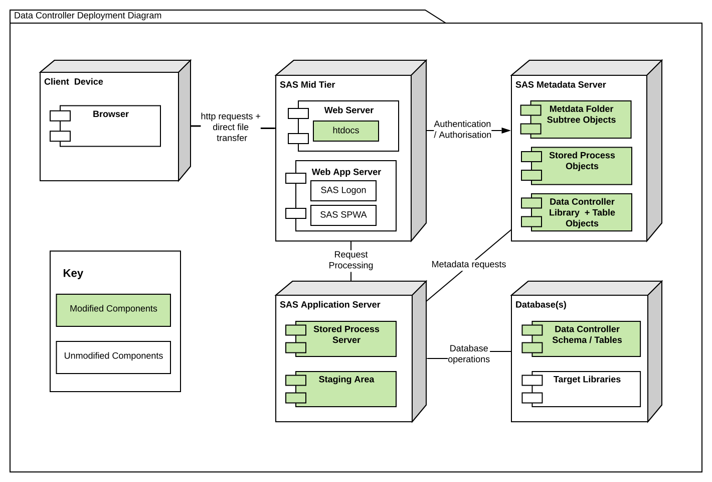

# SAS 9 Deployment

## Deployment Process

There are two ways to deploy Data Controller on SAS 9:

* Full Deployment (preferred)
* Streaming (for quick demos)

### Full Deployment

#### 1 - Deploy Stored Processes

The Stored Processes are deployed using a SAS Program.  This should be executed using an account that has WRITE permissions to the necessary root folder (`appLoc`) in metadta.

```sas
%let appLoc=/Shared Data/apps/DataController;  /* CHANGE THIS!! */
filename dc url "https://git.4gl.io/dc/deploy/-/raw/main/s9_noweb.sas";
%inc dc;
```

If you don't have internet access from SAS, download the file and change the appLoc on line 2:  [https://git.4gl.io/dc/deploy/-/raw/main/s9_noweb.sas


You can also change the `serverName` here, which is necessary if you are using any other logical server than `SASApp`.

#### 2 - Deploy the Frontend

The Data Controller frontend comes pre-built, and ready to deploy to the root of the SAS Web Server (mid-tier).

Deploy as follows:

1.  Download the zip file from: [https://git.4gl.io/dc/deploy/-/raw/main/frontend.zip](https://git.4gl.io/dc/deploy/-/raw/main/frontend.zip)
2. Unzip and place in the [htdocs folder of your SAS Web Server](https://sasjs.io/frontend-deployment/#sas9-deploy) - typically `!SASCONFIG/LevX/Web/WebServer/htdocs`.
3. Open the `index.html` file and update the values for `appLoc` (per SAS code above) and `serverType` (to `SAS9`).

You can now open the app at `https://YOURWEBSERVER/unzippedfoldername` and follow the configuration steps (DC Physical Location and Admin Group) to complete deployment.

#### 3 - Run the Configurator

When opening Data Controller for the first time, a configuration screen is presented.  There are two things to configure:

1. Path to the designated physical staging area. Make sure that the SAS Spawned Server account (eg `sassrv`) has WRITE access to this location.
2. Admin Group. ⚠️ Note that anyone in this group will have unrestricted access to Data Controller! ⚠️


After you click submit, the Stored Process will run, configure the staging area and create the library tables (as datasets).

You will then be presented with three further links:

1. Refresh Data Catalog.  Run this to scan all available datasets and update the catalog.
2. Refresh Table Metadata.  Run this to update the table-level data lineage.
3. Launch.  Currently this feature only works for streaming apps - just refresh the page for a full deployment.


### Streaming

The streaming approach is optimised for rapid deployment, and works by bundling the frontend into metadata. This is a highly inefficient way to serve web content, and thus should only really be used for demos / evaluation purposes.

Deployment is very easy - just run the SAS code below (after changing the `appLoc`):

```sas
%let appLoc=/Shared Data/apps/DataController;  /* CHANGE THIS!! */
filename dc url "https://git.4gl.io/dc/deploy/-/raw/main/s9.sas";
%inc dc;
```

If you don't have internet access from your SAS environment, you can also [download the file directly](https://git.4gl.io/dc/deploy/-/raw/main/s9.sas) and modify the `appLoc` on line 2, as follows:


After that, continue to the configuration as described above.

## Deployment Diagram

A Full Deployment of Data Controller for SAS 9 consists of:

* Frontend on the web server
* Stored Processes (+ Library & Table definitions) in metadata
* Staging Area on the physical filesystem
* Database _or_ SAS Base library

The below areas of the SAS platform are modified when deploying Data Controller:



### Client Device

Nothing needs to be deployed or modified on the client device.  We support a wide range of browsers (the same as SAS).  Browsers make requests to the SAS Web Server, and will cache assets such as JS, CSS and images.  Some items (such as dropdowns) are kept in local storage to improve responsiveness.

### SAS Mid Tier

A single `index.html` file plus several CSS / JS / image files are served from a subfolder in the static content area SAS Web Server.

This is served up by the _existing_ SAS Web Server, no additional server (running) process is required.

If you are running more than one web server, you will need to deploy to them all.


### SAS Application Server

Given the enhanced permissions needed of the system account, a dedicated / secured STP instance is recommended as described [here](/dci-stpinstance).

All deployments of Data Controller also make use of a physical staging directory.  This is used to store staged data, logs, plus CSV and Excel files as uploaded by end users.  This directory should NOT be accessible by end users - only the SAS system account (eg `sassrv`) requires access to this directory.

A typical small deployment will grow by a 10-20 mb each month.  A very large enterprise customer, with 100 or more editors, might generate up to 1 GB or so per month, depending on the size and frequency of the Excel EUCs and CSVs being uploaded.  Web modifications are restricted only to modified rows, so are typically just a few kb in size.


### SAS Metadata Server

The items deployed to metadata include:

 * Folder tree
 * Stored Processes
 * Library Object & tables

 All SAS code is embedded in Stored Processes (so there is no need to deploy programs to the file system, no SASAUTOs).  There is no use of X commands, no use of external internet access, full LOCKDOWN is supported.

 After the installation process (which updates `public/settings` and removes the `admin/makedata` STP), there are no write actions performed against metadata.

### Databases

We strongly recommend that the Data Controller configuration tables are stored in a database for concurrency reasons.

We have customers in production using Oracle, Postgres, Netezza, SQL Server to name a few.  Contact us for support with DDL and migration steps for your chosen vendor.

!!! note
    Data Controller does NOT modify schemas! It will not create or drop tables, or add/modify columns or attributes.  Only data _values_ (not the model) can be modified using this tool.

To caveat the above - it is also quite common for customers to use a BASE engine library.  Data Controller ships with mechananisms to handle locking (internally) but it cannot handle external contentions, such as those caused when end users open datasets directly, eg with Enterprise Guide or Base SAS.
