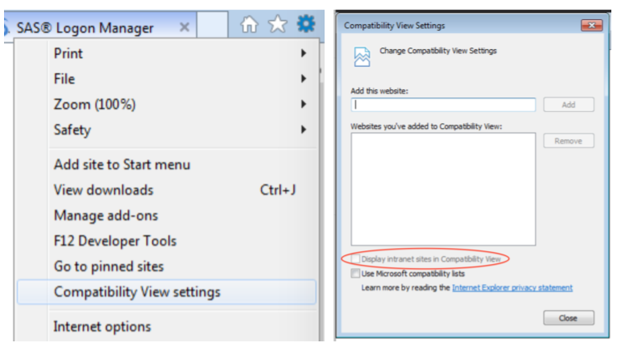

# Data Controller for SAS® - Troubleshooting

## Overview
[Let us know](https://datacontroller.io/contact/) if you experience an installation problem that is not described here!

## Internet Explorer - blank screen
If you have an older, or 'locked down' version of Internet Explorer you may get a blank / white screen when navigating to the Data Controller url.  To fix this, click settings (cog icon in top right), *Compatibility View settings*, then **uncheck** *Display intranet sites in Compatibility view* as follows:

