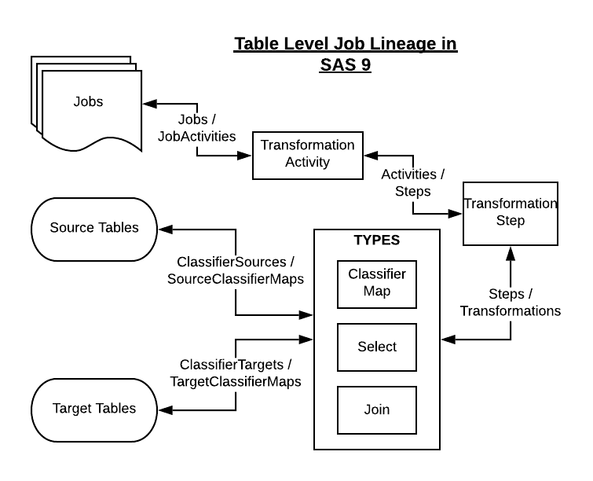

# Data Lineage

The Data Lineage feature is available for SAS 9 installs.  The implementation differs depending on whether the lineage is table level or column level.

## Table Level lineage

Table level lineage is relatively straightforward, and so it is extracted in a single ad-hoc `proc metadata` call and stored in the `DATACTRL.MPE_LINEAGE_TABS` table.  To trigger the population (or refresh) of this table, simply execute the `YOURSERVER/SASStoredProcess/?_program={appLoc}/DataController/admin/refreshtablelineage` service from a browser.

This data is stored with SCD2 so it is possible to track changes to lineage over time.

When users execute table level lineage, queries are made against this table, so there is very little metadata impact.

## Column Level lineage

Column level lineage is more complex as it also includes all the different transforms, and calculation logic along the way.  For this reason it is performed at runtime, which means the initial request can take some time if there is a lot of lineage.

After the first request, subsequent lineage requests (for that particular column and direction) are cached in the `DATACTRL.MPE_LINEAGE_COLS` table for faster response times.

If the job is changed and a new diagram is needed, the user can click the 'refresh' checkbox.

## Export Types

Both Table and column level lineage pages allow the following export formats:

* SVG - high res digram format
* PNG - image format
* DOT - the graphviz language format used to generate the diagram
* CSV - a download of all the sources and targets in the diagram