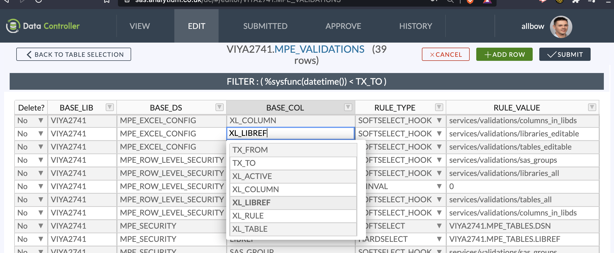

# Dynamic Cell Dropdown

This is a simple, but incredibly powerful feature!  Configure a SAS process to run when clicking a particular cell.  Data Controller will send the *row* to SAS, and your SAS program can use the values in the row determine a *column* of values to send back - which will be used in the frontend selectbox.

So if you'd like the user to only see products for a particular category, or ISIN's for a particular asset group, you can perform that easily.

This feature is used extensively in Data Controller to fetch tables specific to a library, or columns specific to a table:




You can also use the response to populate _other_ dropdowns (also in the same row) in the same request - these are called 'extended validations'.

<iframe width="560" height="315" src="https://www.youtube.com/embed/rmES77aIr90" title="YouTube video player" frameborder="0" allow="accelerometer; autoplay; clipboard-write; encrypted-media; gyroscope; picture-in-picture" allowfullscreen></iframe>

## Frontend Configuration

Open the MPE_VALIDATIONS table and configure the library, table and column that should contain the selectbox.  In the RULE_TYPE column, enter either:

* HARDSELECT_HOOK - The user entry MUST match the returned values
* SOFTSELECT_HOOK - The user can view the list but type something else if they wish

The RULE_VALUE column should contain the full path to the SAS Program, Viya Job or SAS 9 Stored process that you would like to execute.  If the value ends in ".sas" then it is assumed to be a SAS program on a directory, otherwise a SAS web service (STP or Viya Job).

## Backend Configuration

If creating a Stored Process, be sure to deselect the 'automatic SAS macros' - the presence of %stpbegin or %stpend autocall macros will cause problems with the Data Controller backend.

You can write any SAS code you wish. For examples of hook scripts you can look at the Data Controller internal validation programs (listed in the MPE_VALIDATIONS table). You will receive the following as inputs:

* `work.source_row` -> A dataset containing the **current row** being modified in Data Controller.  This will have already been created in the current SAS session.  All variables are available.  Use this to filter the initial values in `work.dynamic_values`.
* `&DC_LIBREF` -> The DC control library
* `&LIBDS` - The library.dataset being filtered
* `&VARIABLE_NM` - The column for which to supply the validation

The following tables should be created in the WORK library as outputs:

* `work.dynamic_values`
* `work.dynamic_extended_values` (optional)

### `WORK.DYNAMIC_VALUES`
This output table can contain up to three columns:

* `display_index` (optional, mandatory if using `dynamic_extended_values`).  Is a numeric key used to join the two tables.
* `display_value` - always character
* `raw_value` - unformatted character or numeric according to source data type

Example values:

|DISPLAY_INDEX:best.|DISPLAY_VALUE:$|RAW_VALUE|
|---|---|---|
|1|$77.43|77.43|
|2|$88.43|88.43|

### `WORK.DYNAMIC_EXTENDED_VALUES`
This output table is optional.  If provided, it will map the DISPLAY_INDEX from the DYNAMIC_VALUES table to additional column/value pairs, that will be used to populate dropdowns for _other_ cells in the _same_ row.

The following columns should be provided:

* `display_index` - a numeric key joining each value to the `dynamic_values` table
* `extra_col_name` - the name of the additional variable(s) to contain the extra dropdown(s)
* `display_value` - the value to display in the dropdown.  Always character.
* `display_type` - Either C or N depending on the raw value type
* `raw_value_num` - The unformatted value if numeric
* `raw_value_char` - The unformatted value if character
* `forced_value` - set to 1 to force this value to be automatically selected when the source value is changed. If anything else but 1, the dropdown will still appear, but the user must manually make the selection.

Example Values:

|DISPLAY_INDEX:best.|EXTRA_COL_NAME:$32|DISPLAY_VALUE:$|DISPLAY_TYPE:$1.|RAW_VALUE_NUM|RAW_VALUE_CHAR:$5000|FORCED_VALUE|
|---|---|---|---|---|---|---|
|1|DISCOUNT_RT|"50%"|N|0.5||.|
|1|DISCOUNT_RT|"40%"|N|0.4||0|
|1|DISCOUNT_RT|"30%"|N|0.3||1|
|1|CURRENCY_SYMBOL|"GBP"|C||"GBP"|.|
|1|CURRENCY_SYMBOL|"RSD"|C||"RSD"|.|
|2|DISCOUNT_RT|"50%"|N|0.5||.|
|2|DISCOUNT_RT|"40%"|N|0.4||1|
|2|CURRENCY_SYMBOL|"EUR"|C||"EUR"|.|
|2|CURRENCY_SYMBOL|"HKD"|C||"HKD"|1|


### Code Examples

Simple dropdown

```sas
/**
  @file
  @brief Simple dynamic cell dropdown for product code
  @details The input table is simply one row from the
  target table called "work.source_row".

  Available macro variables:
    @li DC_LIBREF - The DC control library
    @li LIBDS - The library.dataset being filtered
    @li VARIABLE_NM - The column being filtered

  <h4> Service Outputs </h4>
  Output should be a single table called
  "work.dynamic_values" in the format below.

  |DISPLAY_VALUE:$|RAW_VALUE:??|
  |---|---|
  |$44.00|44|

**/

%dc_assignlib(READ,mylibref)
proc sql;
create table work.DYNAMIC_VALUES as
  select distinct some_product as raw_value
  from mylibref.my_other_table
  where area in (select area from work.source_row)
  order by 1;

```

Extended dropdown

```sas
proc sql;
create table work.source as
  select libref,dsn
  from &DC_LIBREF..MPE_TABLES
  where tx_to > "%sysfunc(datetime(),E8601DT26.6)"dt
  order by 1,2;

data work.DYNAMIC_VALUES (keep=display_index raw_value display_value);
  set work.source end=last;
  by libref;
  if last.libref then do;
    display_index+1;
    raw_value=libref;
    display_value=libref;
    output;
  end;
  if last then do;
    display_index+1;
    raw_value='*ALL*';
    display_value='*ALL*';
    output;
  end;
run;

data work.dynamic_extended_values(keep=display_index extra_col_name display_type
    display_value RAW_VALUE_CHAR raw_value_num forced_value);
  set work.source end=last;
  by libref dsn;
  retain extra_col_name 'ALERT_DS';
  retain display_type 'C';
  retain raw_value_num .;
  raw_value_char=dsn;
  display_value=dsn;
  forced_value=0;

  if first.libref then display_index+1;
  if last.libref then do;
    display_value='*ALL*';
    raw_value_char='*ALL*';
    forced_value=1;
    output;
  end;
  else output;

  if last then do;
    display_value='*ALL*';
    raw_value_char='*ALL*';
    forced_value=1;
    output;
  end;
run;
```

## Technical Notes

When first clicking on a 'dynamic dropdown' cell, the frontend will first hash the entire row, and store the subsequent response from SAS against this hash in an internal lookup table.  In this way, the lookup table can be subsequently referenced to vastly improve performance (by avoiding unnecessary server requests).

The lookup event will occur immediately upon clicking on the (dynamic dropdown) cell.  If the row has not changed since the previous click, the response will be instant. If any value in the row HAS changed, and that particular combination of values has not previously been requested (in the same browser session), then a request to SAS will need to take place before the dropdown values are shown.
