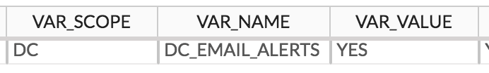

Data Controller for SAS® - Emails
====================

## Overview
Data Controller enables email alerts for users when tables are:

* SUBMITTED - a proposed change has been submitted.
* APPROVED - the proposed change was approved and applied.
* REJECTED - the proposed change was rejected.

Emails are sent after any post edit / post approve hooks.  They can be sent when specific tables are updated, or when any tables in a particular library are updated, or for all changes to all tables.  See configuration section below.

Email addresses are looked for first in `DCXXXXXX.MPE_EMAILS`.  If they are not found there, then a metadata search is made (the first email found in metadata for that user is used).

<iframe src="https://player.vimeo.com/video/343401440" width="640" height="360" frameborder="0" allow="autoplay; fullscreen" allowfullscreen></iframe>

## Setup
As not every site has emails configured, this feature is switched OFF by default.
To switch it on, navigate to `DCXXXXXX.MPE_CONFIG` and set the value for `DC_EMAIL_ALERTS` to be `YES` (uppercase).

!!! tip
    If your Stored Process session does not have the email options configured, then the appropriate options statement must be invoked.  These options may need to be done at startup, or in the configuration file.  See [documentation](https://documentation.sas.com/?cdcId=pgmsascdc&cdcVersion=9.4_3.4&docsetId=lrcon&docsetTarget=n05iwqtqxzvtvun1eyw11nrd9i9r.htm&locale=en)

## Configuration
The `DCXXXXXX.MPE_ALERTS` table must be updated with the following attributes:

* ALERT_EVENT - either `*ALL*`, `SUBMITTED`, `APPROVED` or `REJECTED`
* ALERT_LIB - either `*ALL*` or the libref to be alerted on
* ALERT_DS - either `*ALL*` or the dataset name to be alerted on
* ALERT_USER - the metadata name (not displayname) of the user to be alerted

If your site does not put emails in metadata, then the user emails must instead be entered in `DCXXXXXX.MPE_EMAILS`.