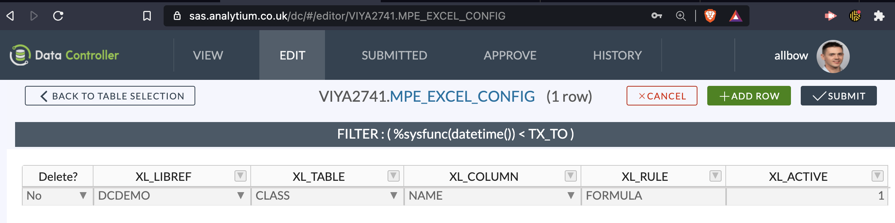
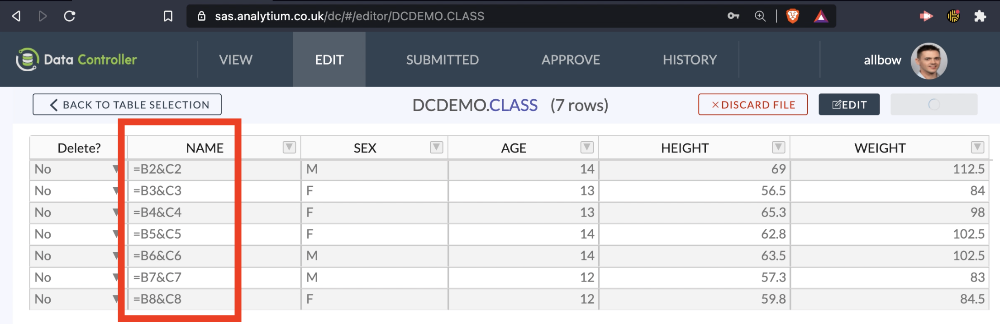

# Excel Uploads

Data Controller for SAS&reg; supports all versions of excel.  Data is extracted from excel from within the browser - there is no need for additional SAS components.  So long as the column names match those in the target table, the data can be on any worksheet, start from any row, and any column.
The data can be completely surrounded by irrelevant data - the extraction will stop as soon as it hits one empty cell in a primary key column.  The columns can be in any order, and are not case sensitive.  More details [here](/dcu-fileupload/#excel-uploads).

## Formulas

It is possible to configure certain columns to be extracted as formulae, rather than raw values.  The target column must be character, and it should be wide enough to support the longest formula in the source data.  If the order of values is important, you should include a row number in your primary key.

Configuration is as follows:

Once this is done, you are ready to upload:

<iframe width="560" height="315" src="https://www.youtube.com/embed/Reg803vI2Ak" title="YouTube video player" frameborder="0" allow="accelerometer; autoplay; clipboard-write; encrypted-media; gyroscope; picture-in-picture" allowfullscreen></iframe>

The final table will look like this:

If you would like further integrations / support with excel uploads, we are happy to discuss new features.  Just [get in touch](https://datacontroller.io/contact).

