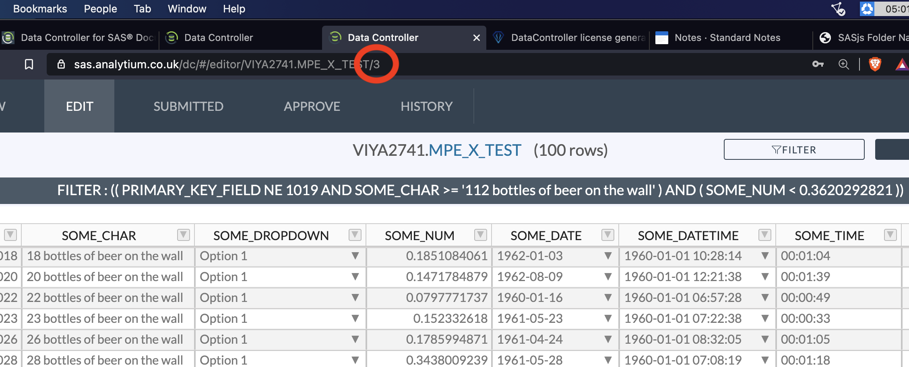
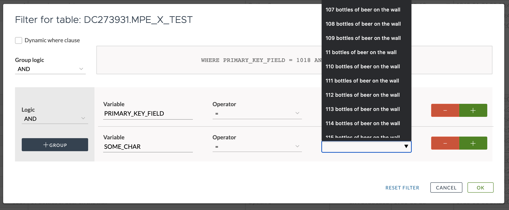

# Filtering

Data Controller for SAS&reg; enables you to create complex table filters. The "dynamic" setting enables the dropdown values to be pre-filtered by previous filter clauses.  Filtered views are shareable!

## Shared Filters

When filters are submitted, the query is stored, and a unique URL is generated.  This means you can share the link to a filtered view of a table!  This can be used for VIEW, for EDIT and also for downloading data.

## Dynamic Where Clause

When filtering *without* a dynamic where clause, all values are always returned in the selection box.

By contrast, when the dynamic where clause box is checked (default), the values in the *second and subsequent* filter clauses are filtered by the previous filter clause settings, eg:

