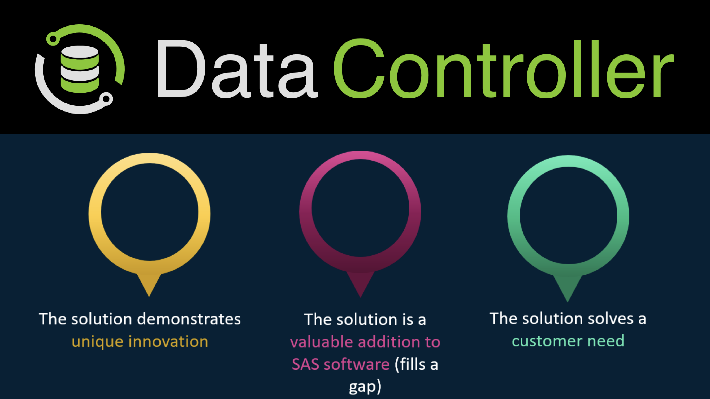
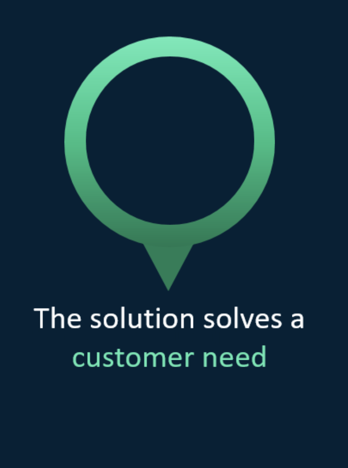
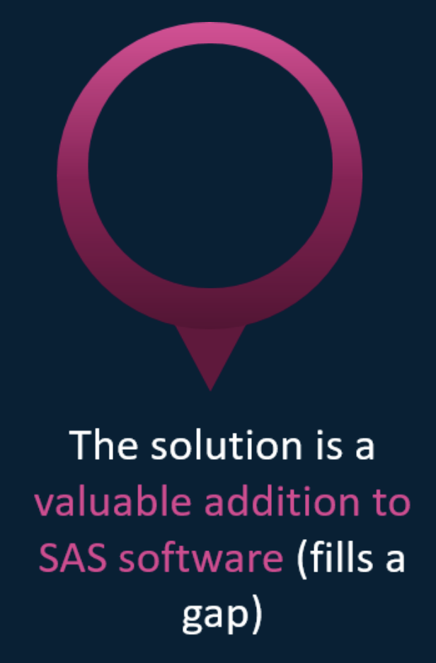
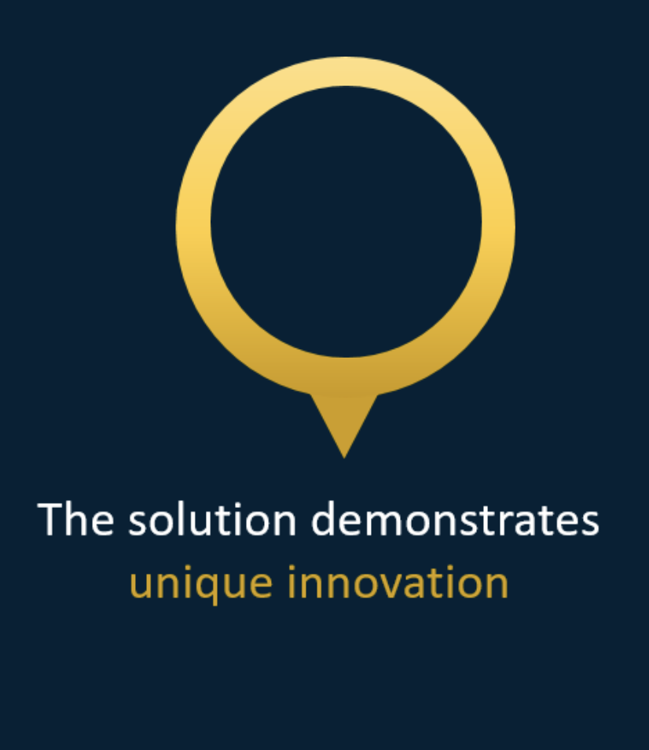

---
<!-- header:  -->

# Data Controller for SAS&reg;
## Allan Bowe

_Capturing Business Data_

   

---

# Loading Business Data to Controlled Platforms
[https://app.vyond.com/videos/2d8ffb4d-560b-4d51-a012-3a55414eed8c](https://app.vyond.com/videos/2d8ffb4d-560b-4d51-a012-3a55414eed8c)

---

# SAS 9 Data Lineage

- [Table Level](https://vimeo.com/424504424)
- [Column Level](https://vimeo.com/383391622)

---

# Customer Feedback

|Insurance|Pharma|Travel & Tourism|
|---|---|---|
||||

[datacontroller.io/category/use-cases](https://datacontroller.io/category/use-cases/)

---

# Complementary Products
- DI Studio 
- DDS Implementations
- Viya 4

---

# Complementary Strategy

- New SAS Customers
- Increased adoption of SAS
- Encourage Cloud Migration (Seamless v9 - Viya)

---

# Open Source

SAS Dev Ops framework

<!-- developer experience -->

- [@sasjs/core](https://github.com/sasjs/core) - Macro library
- [@sasjs/adapter](https://github.com/sasjs/adapter) - SAS Connectivity
- [@sasjs/cli](https://github.com/sasjs/cli) - CI / CD 

---

# Easy to Deploy

[https://vimeo.com/328175910](https://vimeo.com/328175910)

---

# Pricing

 - Accessible (free for up to 5 users)
 - Simple (1k EUR per user per year)
 - Capped (100k per year)

---

# Roadmap

 - Row Level Security
 - Container for Viya 4
 - App Support for Base SAS

---

# questions <!-- fit -->

